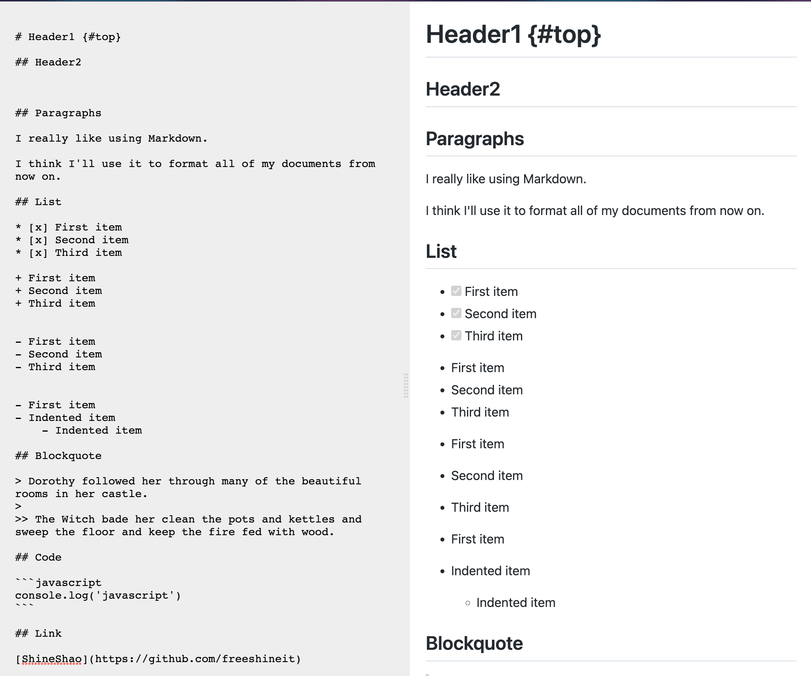

# Wasm Markdown


## Description

Wasm parse markdown


## Demo



## Use

```bash

#
yarn install

# development
yarn run dev

# production
yarn run build

# https://github.com/http-party/http-server
# version >= 14
cd docs && http-server -p 8080

```

## Catalogue

```bash
.
├── LICENSE
├── README.md
├── app            # FE
│   ├── index.ts
│   └── style.scss
├── package.json
├── public        # static files
│   └── index.html
├── tests         # test
│   └── web.rs  
├── wasm  
│   ├── pkg       # wasm-pack compiled product
│   ├── src
│   └── target    # rust target
├── webpack.config.js
└── yarn.lock
```
